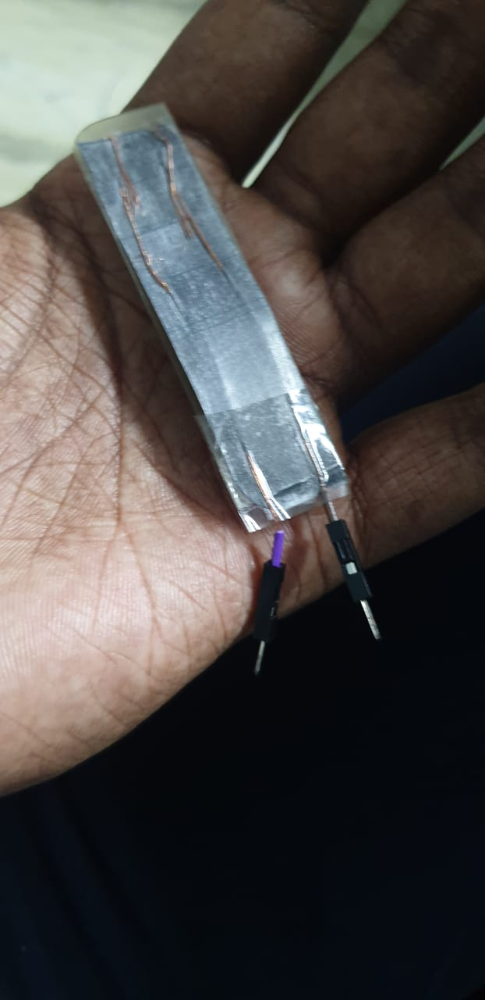

# Random Projects

A collection of small/random projects that cannot be put in a repository of their own.
***

### Home-made flex sensor:
Making a flex sensor with a pencil, a piece of paper, two wires, plastic sheet.
Following the instructions in [this video](https://www.youtube.com/watch?v=SJNYbSpvlP8&t=2s).

### Line detection using Picam:
Processing the output of a picamera to obtain the position of a curve or line.
To be used with line-follower projects.

### Home-made flex sensor version-2:
Making a flex sensor with a pencil, a piece of paper, two card paper pieces, two pieces of aluminium foil: following the instructions in [this article](https://www.instructables.com/How-to-Make-FLEX-Sensor-at-Home-DIY-Flex-Sensor/).

Structured a frame for using it on my finger: using two ribbon pieces. Code for actuating a servo based on my finger movement(fingering?). Checkout the [video](https://github.com/Roboramv2/Random-projects/blob/main/3_flexv2/v2demo.mp4).

